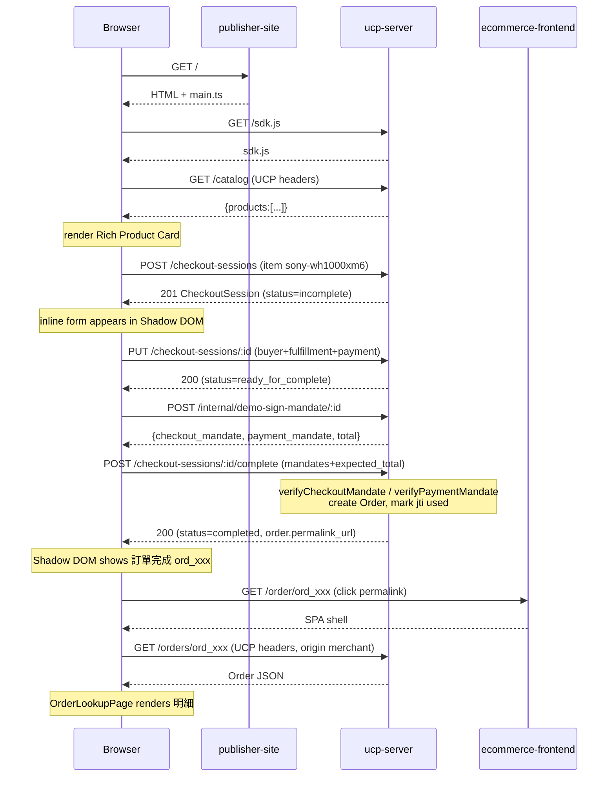

# 資訊架構與消費者旅程

> UCP Agentic Commerce Demo — 完整系統圖像
> 最後更新：2026-04-16
> 搭配文件：`2026-04-15-ucp-agentic-commerce-demo-design.md`（設計決策）、`…-plan.md`（42 task 計畫）

本文件用單一視角串起整套 demo 的「系統長什麼樣」與「使用者走過什麼」。分兩大節：

- **§1 資訊架構**：三服務角色、資料流、實體模型、信任鏈
- **§2 消費者旅程**：從瀏覽文章到訂單查詢的每個階段

---

## §1 資訊架構

### 1.1 高層拓撲

```
┌──────────────────────────────────────────────────────────────┐
│                        Consumer (Browser)                    │
└─────┬───────────────┬─────────────────────────────┬──────────┘
      │               │                             │
      │ (1) 文章      │ (2) inline checkout         │ (6) order
      │               │     via Shadow DOM SDK      │
      ▼               ▼                             ▼
┌─────────────┐ ┌─────────────────────┐ ┌──────────────────────┐
│ publisher-  │ │      ucp-server     │ │  ecommerce-frontend  │
│    site     │ │  (UCP REST + JWT)   │ │   (Merchant Vue 3)   │
│  :3002      │ │       :3001         │ │        :3000         │
│             │ │                     │ │                      │
│ 文章 + SDK  │ │ sessions / orders / │ │ 商品 / 訂單明細 /   │
│ (Vite SPA)  │ │ mandates / jwks     │ │ Schema.org JSON-LD  │
└─────────────┘ └──────────┬──────────┘ └──────────────────────┘
                           │
                  ┌────────┴────────┐
                  │  in-memory      │
                  │  store (MVP)    │
                  │  sessions       │
                  │  orders         │
                  │  idempotency    │
                  │  mandates (jti) │
                  └─────────────────┘
```

三個服務 = 三個 origin = 需要跨域（CORS）；實務上會各自部署到不同網域/Cloud Run URL。

### 1.2 三服務的角色

| 服務 | 代表 | 主要職責 | Stack |
|---|---|---|---|
| **publisher-site** | 第三方媒體（TechReview Taiwan） | 文章內容 + 嵌入 UCP 廣告 SDK + inline checkout UI | Vite + TS + Shadow DOM web components |
| **ucp-server** | UCP 協定實作（在真實情境可能由 marketplace / platform 提供） | `/checkout-sessions`、`/orders`、mandate 驗證與簽章、狀態機、idempotency | Node 20 + Express + TS + jose |
| **ecommerce-frontend** | Merchant（商家店面） | 商品頁 + Schema.org JSON-LD + 訂單查詢 + 歷史既有購物車 | Vue 3 + vue-router + pinia |

設計刻意讓三者 **獨立 origin**，展示 UCP 的「跨域代理商業」核心命題：**消費者在非 merchant 的網站完成結帳**。

### 1.3 關鍵實體（Entity Model）

```
CheckoutSession
├── id                chk_<8 hex>
├── status            incomplete | ready_for_complete | completed | canceled
├── currency          TWD
├── line_items[]      { id, item{id,title,price,image_url}, quantity, totals[] }
├── totals[]          [{type: subtotal|tax|shipping|total, amount, currency}]
├── buyer             { email, first_name, last_name }
├── fulfillment       { destinations[], method_type }
├── payment           { instruments[{handler_id, type, credential?}] }
├── ap2               { checkout_mandate: <JWS> }     ← 完成後填
├── order             { id, permalink_url }            ← 完成後填
├── messages[]        UCP 訊息陣列
├── links             { terms_of_service }
└── ucp               { version, capabilities[], payment_handlers[] }

Order
├── id                ord_<8 hex>
├── checkout_id       指回 CheckoutSession
├── permalink_url     http://…/ecommerce-frontend/order/<id>
├── line_items[]      + status: processing
├── fulfillment       { expectations[], events[] }
├── adjustments[]
└── totals[]

Mandate（JWT payload）
├── CheckoutMandate   { checkout_id, checkout_hash, iss, aud, exp, jti }
└── PaymentMandate    { checkout_id, amount, currency, iss, aud, exp, jti } + 尾綴 '~'
```

所有實體 **in-memory 儲存於 ucp-server**（demo MVP）。真實部署會換成資料庫 + 分散式 idempotency store。

### 1.4 資料流（Data Flow）

```
┌─ merchant PRODUCTS (硬編碼 src/data/products.ts) ─┐
│                                                   │
│  GET /catalog  ───(Schema.org Product[])──►  publisher-site AdSlot
│                                                   │
│  hydrateLineItems(session request)                │
│       │ 從 PRODUCTS 填 title/price/image         │
│       ▼                                           │
│  sessionStore (in-memory)                         │
│       │ POST create/update/complete               │
│       │ verify mandates via jwt.ts                │
│       ▼                                           │
│  orderStore (in-memory)                           │
│       │ GET /orders/:id                           │
│       ▼                                           │
│  ecommerce-frontend OrderLookupPage (pemalink)    │
└───────────────────────────────────────────────────┘
```

**關鍵不變量**：

- **金額計算權**在 ucp-server（subtotal + 5% tax + 0 shipping = total），client 提交的 `expected_total` 僅用於驗證 — 不同則 reject
- **商品 catalog 來源** 是 ucp-server 的硬編碼 `PRODUCTS`；publisher 透過 `/catalog` 取得。真實 UCP 會由 merchant JSON-LD / GMC feed 取代
- **Session 唯一 owner 是 ucp-server**；publisher/merchant 都只讀，不改 session state

### 1.5 安全與信任層

```
┌─ Origin layer ────────────────────────────────────────┐
│ CORS allowlist (UCP_ALLOWED_ORIGINS)                  │
│   localhost:3000 (merchant) + localhost:3002 (pub)    │
└──────────────────┬────────────────────────────────────┘
                   ▼
┌─ Transport layer ─────────────────────────────────────┐
│ UCP headers middleware                                │
│   UCP-Agent  = profile="<url>"                        │
│   Request-Id = <uuid>                                 │
│   Idempotency-Key = <uuid>  (POST/PUT)                │
└──────────────────┬────────────────────────────────────┘
                   ▼
┌─ Idempotency layer ───────────────────────────────────┐
│ (method, path, key) → cached response (24h TTL)       │
│ 同 key 同 body 二次提交回快取；不同 body 回 409       │
└──────────────────┬────────────────────────────────────┘
                   ▼
┌─ State machine ───────────────────────────────────────┐
│  incomplete ──(PUT with buyer+fulfillment+payment)──► │
│      ready_for_complete ──(POST /complete)──►         │
│      completed                                        │
│                                                       │
│  incomplete|ready_for_complete ──(POST /cancel)──►    │
│      canceled                                         │
└──────────────────┬────────────────────────────────────┘
                   ▼
┌─ Mandate layer (ES256 JWS) ───────────────────────────┐
│ CheckoutMandate:                                      │
│   checkout_hash = sha256(JSON.stringify({id, total})) │
│   driven by server - 若 client 送假的 hash 被擋       │
│                                                       │
│ PaymentMandate (SD-JWT-VC shape):                     │
│   amount, currency, checkout_id  — 必對齊 session     │
│   jti 一次性 (replay 防護)                            │
└──────────────────┬────────────────────────────────────┘
                   ▼
┌─ Response signing (RFC 9421) ─────────────────────────┐
│ Content-Digest + Signature-Input + Signature headers  │
│ client 可驗證回應真偽；request 簽章不強制             │
└───────────────────────────────────────────────────────┘
```

**demo 僅 90% 擬真**（`design.md §4`）：真實 UCP 中 `PaymentMandate` 是 SD-JWT-VC 含 selective disclosure + 由 buyer wallet 簽章；demo 裡是 server-side 簽且無 SD。

### 1.6 端點地圖（ucp-server）

| 族群 | 端點 | 主要用途 |
|---|---|---|
| health | `GET /healthz` | liveness probe |
| checkout | `POST /checkout-sessions` | 建立 session |
| checkout | `GET /checkout-sessions/:id` | 取 session |
| checkout | `PUT /checkout-sessions/:id` | 補 buyer/fulfillment/payment |
| checkout | `POST /checkout-sessions/:id/complete` | 驗 mandate + 建單 |
| checkout | `POST /checkout-sessions/:id/cancel` | 取消 |
| order | `GET /orders/:id` | merchant permalink 使用 |
| demo | `GET /catalog` | 回 Schema.org Product[] |
| demo | `POST /internal/demo-sign-mandate/:id` | server-side 簽 mandate（dev-only） |
| key | `GET /.well-known/jwks.json` | 公鑰 |
| static | `GET /sdk.js` | publisher 嵌入的 SDK skeleton |

OpenAPI spec：`ucp-server/openapi.yaml`。

### 1.7 跨服務連結

```
┌── publisher-site/index.html ───────────────┐
│  <script>                                  │
│    window.__UCP_API__ = 'http://…:3001';   │  ← 指向 ucp-server
│  </script>                                 │
│  <script src="http://…:3001/sdk.js">       │  ← 跨域載 SDK
│  <script type="module" src="/src/main.ts"> │  ← 本地 Vite bundle
│  <div data-ucp-ad slot="sony-wh1000xm6" /> │  ← 廣告位
└────────────────────────────────────────────┘

┌── ucp-server 簽出的 permalink ─────────────┐
│  ${MERCHANT_URL}/ecommerce-frontend/       │
│    order/ord_<id>                          │  ← 指向 merchant OrderLookupPage
└────────────────────────────────────────────┘

┌── ecommerce-frontend OrderLookupPage ──────┐
│  import.meta.env.VITE_UCP_API_URL ‖ :3001  │  ← 打回 ucp-server GET /orders/:id
└────────────────────────────────────────────┘
```

部署到 Cloud Run 後，三個 URL 各自變成 `*.run.app`，但拓撲不變。

---

## §2 消費者旅程

### 2.1 Persona

**小明（消費者）**：在第三方科技媒體瀏覽降噪耳機評測，看到嵌入式廣告，想在不離開當前頁面的情況下直接購買。

> 沒有 merchant 帳號、不想跳轉、不想再登入 — 這就是 UCP 想解決的 agentic commerce 核心需求。

### 2.2 旅程全景

```
[Phase 0] 瀏覽文章
    │
    ▼
[Phase 1] 看到嵌入式廣告（Rich Product Card）
    │   商品資訊、評分、庫存、價格一覽
    ▼
[Phase 2] 點「立即購買」
    │   背景呼叫 POST /checkout-sessions
    ▼
[Phase 3] 填寫買家/配送資訊
    │   還在 publisher 頁面、Shadow DOM 包覆
    │   背景 PUT /checkout-sessions/:id
    ▼
[Phase 4] 點 Google Pay mock → 點「確認訂單」
    │   背景 POST /internal/demo-sign-mandate
    │   背景 POST /checkout-sessions/:id/complete
    ▼
[Phase 5] 看到「✅ 訂單完成 ord_xxx」+ 查看訂單連結
    │
    ▼
[Phase 6] 點 permalink → 跳到 merchant 訂單明細頁
```

全程 **不離開 publisher 主頁**，直到主動點 permalink 才進 merchant 站。

### 2.3 各階段細節

#### Phase 0 — 瀏覽

| 動作 | 系統回應 | UCP 層動作 |
|---|---|---|
| 小明打開 `http://publisher/` | 文章頁載入 | — |
| 頁面載入 `http://ucp/sdk.js` | SDK 全域 `window.UcpSdk` 註冊（skeleton） | `GET /sdk.js` cross-origin |
| `main.ts` 執行 `mountAdSlots()` | 每個 `[data-ucp-ad]` 取得 `<ucp-ad-slot>` child + attach shadow root | — |
| AdSlot connectedCallback | 呼叫 `getCatalog()` | `GET /catalog` with UCP headers |

#### Phase 1 — 看到廣告

```
┌──── Shadow DOM ─────────────────────┐
│  ⚡ Live Commerce Ad                │
│  ┌─────┐                            │
│  │ 📷  │  Sony WH-1000XM6           │
│  │     │  NT$7,990                  │
│  └─────┘  ✅ 有貨・免運  ⭐ 4.7    │
│                                     │
│          [立即購買 →]              │
└─────────────────────────────────────┘
```

重點：
- Shadow DOM（`:host { all: initial }`）讓廣告樣式不受 publisher CSS 影響，也不污染 publisher
- Rich Product Card 資料來自 `/catalog` Schema.org 形狀
- 若 `/catalog` 失敗（網路、CORS、404），卡片顯示「廣告載入失敗」而非整頁壞掉

#### Phase 2 — 點購買

| 動作 | 系統回應 |
|---|---|
| Click「立即購買 →」 | 按鈕變「建立 session…」並 disable |
| AdSlot `createSession(productId)` | `POST /checkout-sessions` |

**請求樣板**：
```http
POST /checkout-sessions HTTP/1.1
Host: ucp-server
UCP-Agent: profile="http://publisher/profile"
Request-Id: <uuid>
Idempotency-Key: <uuid>
Content-Type: application/json

{
  "currency": "TWD",
  "line_items": [
    { "item": { "id": "sony-wh1000xm6" },
      "quantity": { "original": 1, "total": 1, "fulfilled": 0 } }
  ]
}
```

**回應**：`201` + CheckoutSession `{id: "chk_...", status: "incomplete", totals: [subtotal, tax, shipping, total]}`，金額由 ucp-server 自 PRODUCTS 計算。

#### Phase 3 — 填表

表單在 Shadow DOM 內展開（買 button 隱藏）：

| 欄位 | 備註 |
|---|---|
| first_name / last_name | 必填 |
| email | 必填 |
| line1（地址） | 必填 |
| city | 預填「台北市」 |
| postal_code | 預填「100」 |

submit handler 先發送：

```
PUT /checkout-sessions/:id
body: { buyer, fulfillment, payment: { instruments: [{handler_id:'google-pay-mock'}] } }
```

- 狀態機：`incomplete → ready_for_complete`（三區塊齊全就切換）
- 若 PUT 失敗，表單保留、錯誤文字顯示在 `#err`

#### Phase 4 — 授權 + 完成

實際是三個背景請求：

```
① POST /internal/demo-sign-mandate/:id
   → { checkout_mandate, payment_mandate, total }

② POST /checkout-sessions/:id/complete
   body: {
     ap2: { checkout_mandate },
     payment: { instruments: [{ credential: { token: payment_mandate }}] },
     expected_total: total,
     signals: {...}
   }
   → CheckoutSession { status: "completed", order: { id, permalink_url } }
```

**驗證鏈**（complete handler 中）：

```
verifyCheckoutMandate(jws, session.id, hashCheckoutState({id, total}))
  ↓ 成功
verifyPaymentMandate(token, session.id, total)
  ↓ 檢查 jti 未使用過 → markUsed
  ↓ 成功
sessionStore / orderStore 更新
```

任一步失敗 → `400 UCP_MANDATE_INVALID`，狀態保留 `ready_for_complete`（可重試）。

#### Phase 5 — 成功畫面

Shadow DOM 中的 `#checkout` 被替換為：

```
✅ 訂單完成：ord_abcd1234
   查看訂單 →
```

並 `postMessage({type: 'ucp-order-completed', order})` 供 publisher 主頁監聽（用來做分析、再行銷等）。

#### Phase 6 — 訂單查詢

| 動作 | 系統回應 |
|---|---|
| Click「查看訂單 →」 | 瀏覽到 `http://merchant/ecommerce-frontend/order/ord_abcd1234` |
| Vue Router 匹配 `/order/:id` | OrderLookupPage `onMounted` |
| `ucpClient.getOrder(id)` | `GET http://ucp/orders/ord_abcd1234` with UCP headers |
| ucp-server CORS 檢查 | origin = `http://merchant` 在 allowlist ✓ |
| 回 Order JSON | 渲染 line_items / fulfillment / totals |

### 2.4 序列圖（mermaid）



### 2.5 失敗路徑

| 失敗點 | HTTP | code | 消費者看到 |
|---|---|---|---|
| 缺 UCP-Agent | 400 | `UCP_MISSING_UCP_AGENT` | 「廣告載入失敗」（若在 catalog 階段） |
| 未在 allowlist 的 origin | CORS block | — | 廣告白屏或 preflight 失敗 |
| 商品缺貨 | 400 | `UCP_OUT_OF_STOCK` | 「廣告載入失敗：product out of stock」 |
| buyer 未填齊 | session 仍在 `incomplete`；submit 被擋在 complete 401 | `UCP_INVALID_STATE` | 「expected ready_for_complete」錯誤文字 |
| 篡改 checkout_mandate | 400 | `UCP_MANDATE_INVALID` | 「checkout_hash mismatch」 |
| 篡改 expected_total | 400 | `UCP_BAD_REQUEST` | 「expected_total mismatch」 |
| replay payment_mandate | 400 | `UCP_MANDATE_INVALID` | 「payment mandate replay detected」 |
| 取消後又 complete | 409 | `UCP_INVALID_STATE` | 「expected ready_for_complete, got canceled」 |
| permalink 對應訂單找不到 | 404 | `UCP_NOT_FOUND` | OrderLookupPage「載入失敗」 |

### 2.6 每個階段的 Trust Boundary

```
Phase 0-1        ━━━━━━━━━━━━━━━━━━━━━━━━━━━━━━━━━━━━ publisher origin
                 (文章、SDK loader、AdSlot shell)

Phase 1 load ────► ucp-server origin (CORS preflight + /catalog)

Phase 2-4        ━━━━━━━━━━━━━━━━━━━━━━━━━━━━━━━━━━━━ publisher origin
                 (Shadow DOM UI)
                 每次 fetch 跨到 ucp-server origin → CORS + UCP headers

Phase 5 success  回到 publisher origin

Phase 6          ━━━━━━━━━━━━━━━━━━━━━━━━━━━━━━━━━━━━ merchant origin
                 離開 publisher 進 merchant；fetch /orders 又跨回 ucp-server
```

三次跨域 = 三次 CORS check + 三次 UCP headers 驗證。中間任何一個 origin 不在 `UCP_ALLOWED_ORIGINS` 就會斷鏈。

---

## §3 落實到 code 的查找索引

| 主題 | 檔案 |
|---|---|
| session state machine | `ucp-server/src/lib/stateMachine.ts` |
| mandate 簽/驗 | `ucp-server/src/lib/{checkoutMandate,paymentMandate,jwt}.ts` |
| idempotency 快取 | `ucp-server/src/middleware/idempotency.ts` |
| UCP headers 驗證 | `ucp-server/src/middleware/ucpHeaders.ts` |
| CORS allowlist | `ucp-server/src/middleware/cors.ts` |
| response signing (RFC 9421) | `ucp-server/src/middleware/signature.ts` |
| ucp-server endpoints | `ucp-server/src/routes/{checkoutSessions,orders,catalog,health}.ts` |
| products 硬編 | `ucp-server/src/data/products.ts` |
| SDK skeleton | `ucp-server/public/sdk.js` |
| publisher 文章 | `publisher-site/index.html` + `src/styles/article.css` |
| AdSlot Shadow DOM | `publisher-site/src/components/AdSlot.ts` |
| CheckoutForm | `publisher-site/src/components/CheckoutForm.ts` |
| publisher UCP client | `publisher-site/src/lib/ucpClient.ts` |
| publisher mandate 代理 | `publisher-site/src/lib/clientMandate.ts` |
| merchant product JSON-LD | `ecommerce-frontend/src/pages/ProductPage.vue` |
| merchant order page | `ecommerce-frontend/src/pages/OrderLookupPage.vue` |
| merchant UCP client | `ecommerce-frontend/src/utils/ucpClient.js` |
| E2E 完整流程 | `publisher-site/tests/e2e/fullFlow.spec.ts` |

---

## §4 跟真實 UCP 的差距（拿來面試/提案時要坦白）

1. **Payment wallet**：demo 用 Google Pay mock 按鈕 + server-side 簽 mandate。真實版會整合 W3C Payment Request API / Google Pay / Apple Pay SDK，mandate 由 buyer wallet 簽。
2. **Identity linking**：demo 不要求登入；真實版會要 OAuth 2.0 到 merchant / issuer。
3. **SD-JWT-VC**：demo 只做形狀對齊（`~` 尾綴），沒有 selective disclosure 支援。
4. **Discovery**：demo 用 `/catalog`；真實版由 merchant 提供 Schema.org JSON-LD 或 Google Merchant Center feed。
5. **Signature verification scope**：demo 僅 response 簽章；真實版雙向簽 + key rotation + JWKS fetch。
6. **Persistence**：demo in-memory；真實版 DB + queue + idempotency store 分散式。
7. **Multi-merchant**：demo 單一 merchant + 單一 agent；真實版是多對多 marketplace。

---

## §5 總結一句話

> **UCP demo 的精髓**：讓消費者在第三方網站點一個廣告，就能在不跳轉、不開新頁、不註冊 merchant 帳號的情況下，跨三個 origin（publisher / UCP / merchant）完成結帳 — 過程中用 JWT mandate 保護金額不可篡改、用 CORS + UCP headers 保護跨域呼叫者身分、用 idempotency 保護重送不會造成重複建單、用狀態機保護訂單生命週期的不合理轉移。

42 個 task 建的就是這條完整鏈路的最小可驗證實作。
